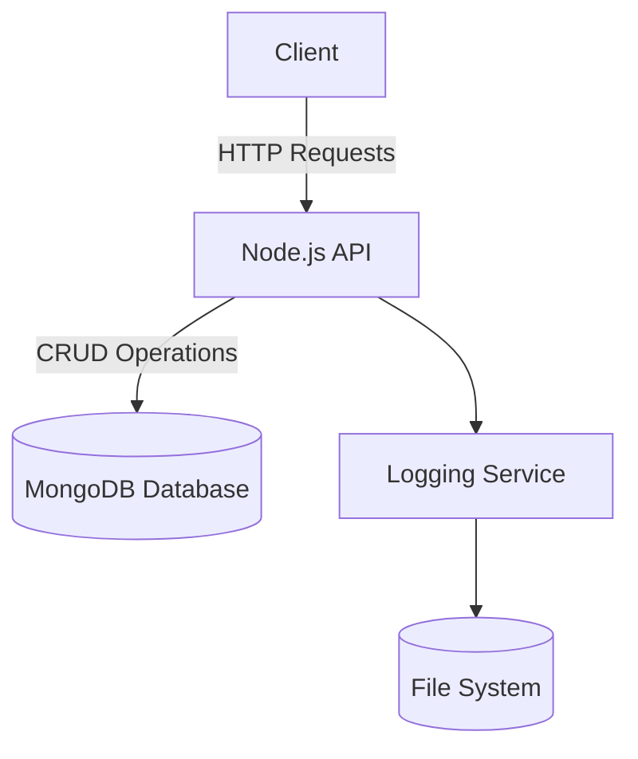
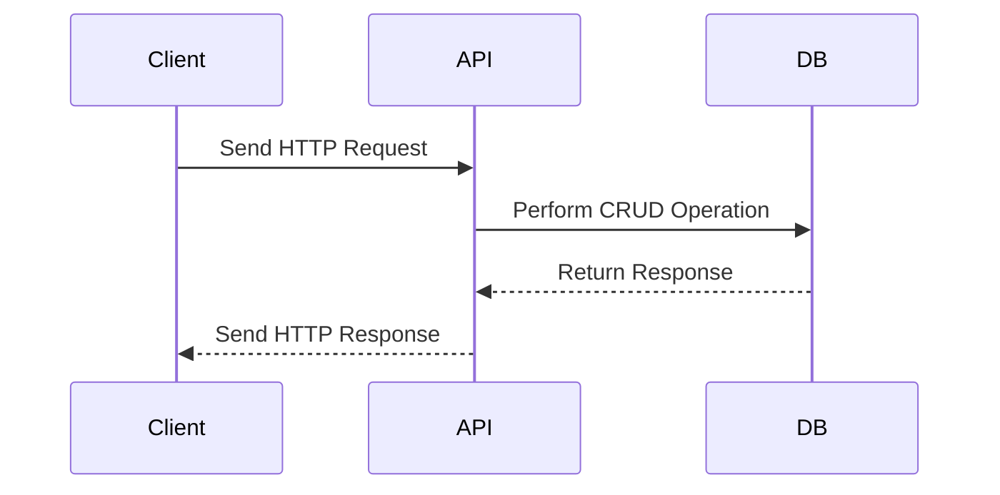

# Sample Node.js Application

This document provides an overview of a sample Node.js application, including its architecture and workflow, with the help of Mermaid diagrams.

## Application Overview

The sample Node.js application is a RESTful API that performs CRUD operations on a database. It uses the following technologies:

- **Node.js**: JavaScript runtime for building the application.
- **Express.js**: Web framework for handling HTTP requests.
- **MongoDB**: NoSQL database for data storage.
- **Mongoose**: ODM library for MongoDB.

## Architecture Diagram



## Workflow Diagram



## Project Structure

```
sample-nodejs-app/
├── src/
│   ├── controllers/
│   ├── models/
│   ├── routes/
│   └── app.js
├── package.json
└── README.md
```

## Getting Started

1. Clone the repository:
   ```bash
   git clone https://github.com/your-repo/sample-nodejs-app.git
   cd sample-nodejs-app
   ```

2. Install dependencies:
   ```bash
   npm install
   ```

3. Start the application:
   ```bash
   npm start
   ```

## Reference Links

- [Node.js Documentation](https://nodejs.org/en/docs/)
- [Express.js Guide](https://expressjs.com/)
- [MongoDB Documentation](https://www.mongodb.com/docs/)
- [Mongoose Documentation](https://mongoosejs.com/docs/)
